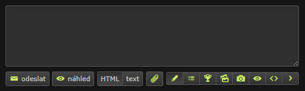

# Additional buttons for Nyx.cz
This code creates a set of functions that add buttons to a web page and insert various types of markup into a textarea, including functions that generate HTML markup for image, video, code, quote, and spoiler content and an addButtonToPage function that adds event listeners to retrieve the URL from the clipboard and insert the appropriate markup.

## The main steps it performs are
This code defines a set of functions to add buttons to a web page and insert various types of markup (image, video, code, quote, and spoiler) into a textarea. The getUrlFromClipboard function uses the navigator.clipboard API to read text from the clipboard and return it after trimming any whitespace. The createButton function creates a button element with a specified title, icon class, and callback function. The generateImageMarkup, generateVideoMarkup, generateCodeMarkup, generateQuoteMarkup, and generateSpoilerMarkup functions generate HTML markup for the corresponding types of content. The insertMarkupIntoTextarea function inserts the specified markup into the textarea at the current cursor position. The addButtonToPage function creates a set of buttons for each type of content, adds event listeners to retrieve the URL from the clipboard, generate the appropriate markup, and insert it into the textarea. Finally, the addButtonToPage function is called to add the buttons to the web page.

## How to install and run this file
1. Install the Custom JavaScript for Websites extension from the Chrome Web Store: https://chrome.google.com/webstore/detail/custom-javascript-for-web/ddbjnfjiigjmcpcpkmhogomapikjbjdk or similar addon for Firefox and other browsers. You can use anything that can execute javascript in the browser.
2. Navigate to https://nyx.cz - where you want to add the buttons.
3. Click on the Custom JavaScript for Websites icon in the browser toolbar.
4. In the extension window that appears, click on the "Add new" button.
5. Give the new script a name (e.g. "Add Markup Buttons").
6. Paste the entire code snippet into the "Code" section of the extension window.
7. Click on the "Save" button to save the script.
8. Refresh the website and the buttons should now appear.

████▀░░░░░░░░░░░░░░░░░░▀███
███│░░░░░░░░░░░░░░░░░░░│███
██▌│░░░░░░░░░░░░░░░░░░░│▐██
██░└┐░░░░░░░░░░░░░░░░░┌┘░██
██░░└┐░░░░░░░░░░░░░░░┌┘░░██
██░░┌┘▄▄▄▄▄░░░░░▄▄▄▄▄└┐░░██
██▌░│██████▌░░░▐██████│░▐██
███░│▐███▀▀░░▄░░▀▀███▌│░███
██▀─┘░░░░░░░▐█▌░░░░░░░└─▀██
██▄░░░▄▄▄▓░░▀█▀░░▓▄▄▄░░░▄██
████▄─┘██▌░░░░░░░▐██└─▄████
██████████┬┬┬┬┬┬┬██████████
██████████M█C█H█N██████████
███████████████████████████
██https://codestormer.com██
███████████████████████████
